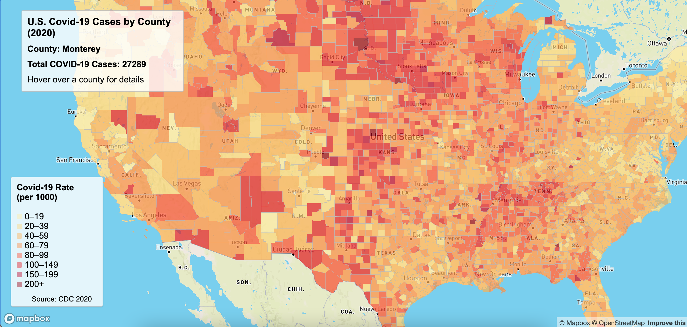
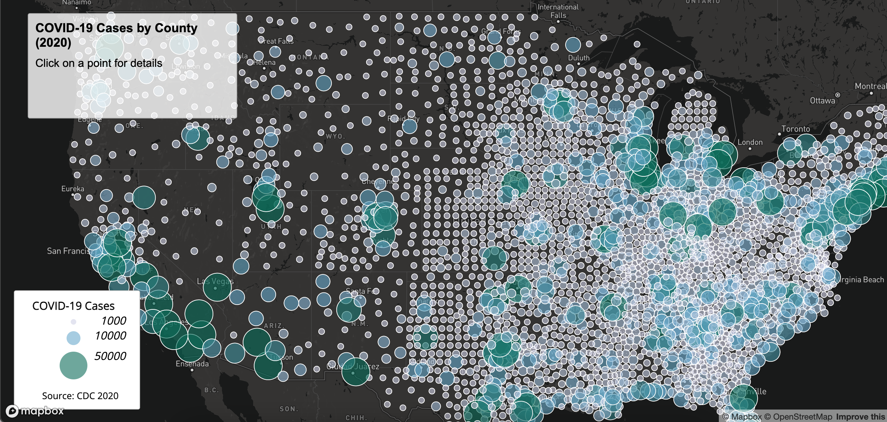

# United States Covid-19 Case Maps (2020)
## *Project Introduction*
For this project, 2020 COVID-19 case data across the United States was collected and cleaned to create two interactive web maps:
1. **Choropleth Map**: displays COVID-19 case rates by county using color shading
2. **Proportional Symbol Map**: displays COVID-19 case totals per county using circles scaled by case count
## *Maps*
- [Choropleth Map](https://cathyat.github.io/covid19_case_maps/map1.html)
- [Proportional Symbol Map](https://cathyat.github.io/covid19_case_maps/map2.html)

## *Screenshots*

## *Primary Functions*
- Choropleth Map: interactive hover for counties displaying county name and case count
- Proportional Map: clickable county points displaying county name and case count
- Legends with color scale and circle size

## *Library and Tools*
- Mapbox GL JS used for interactive maps
- VS Code used for file editing
- Javascript to build maps
- CSS for map styling

## *Data Sources*
- [The New York Times](https://github.com/nytimes/covid-19-data/blob/43d32dde2f87bd4dafbb7d23f5d9e878124018b8/live/us-counties.csv) -> Covid-19 case/death data 
- [2018 ACS 5 year estimates](https://data.census.gov/table/ACSDP5Y2018.DP05?g=0100000US$050000&d=ACS+5-Year+Estimates+Data+Profiles&hidePreview=true) -> Population data for calculating case rates
- [U.S. Census Bureau](https://www.census.gov/geographies/mapping-files/time-series/geo/carto-boundary-file.html) -> source of U.S. county boundary shapefile

## *Credits and Acknowledgements* 
Map styling and interactive elements were inspired by GEOG 458 lab 3 examples and Mapbox GL JS. Thanks to the **NY Times**, **Census Bureau**, and **Mapbox** for providing open-access data and mapping tools for students to freely use for projects like these. Thank you to Professor Zhao and others in creating the lab and providing examples to learn from. 

